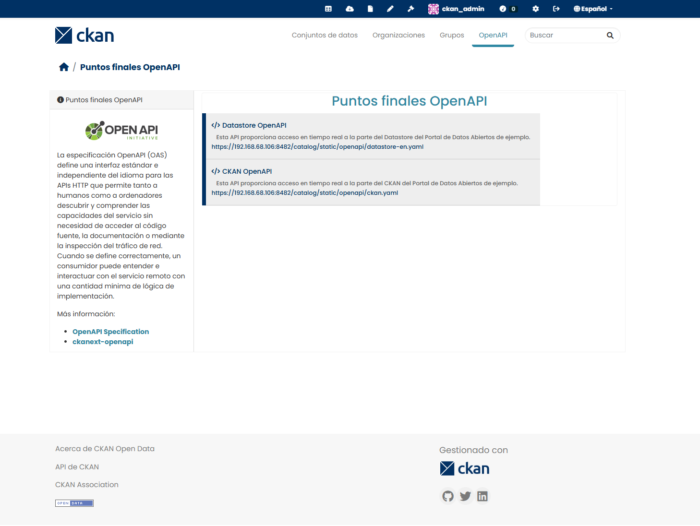

# ckanext-openapi. CKAN instance OpenAPI endpoints.

`ckanext-openapi` is an extension for CKAN that integrates and displays OpenAPI endpoints directly in the CKAN catalog, [^1] supporting both **OpenAPI 2.0.0** and **OpenAPI 3.0.0** specifications.

!!! tip
    
    It is **recommended to use with:** [`ckan-docker`](https://github.com/mjanez/ckan-docker) deployment and [`ckanext-schemingdcat`](https://github.com/mjanez/ckanext-schemingdcat)

!!! warning

    This project requires [ckan/ckanext-scheming](https://github.com/ckan/ckanext-scheming) to work properly.

Enhancements:

- Add custom OpenAPI endpoints directly in the CKAN deployment.
- Use `YAML` or `JSON` OpenAPI files from URLs or relative static content.